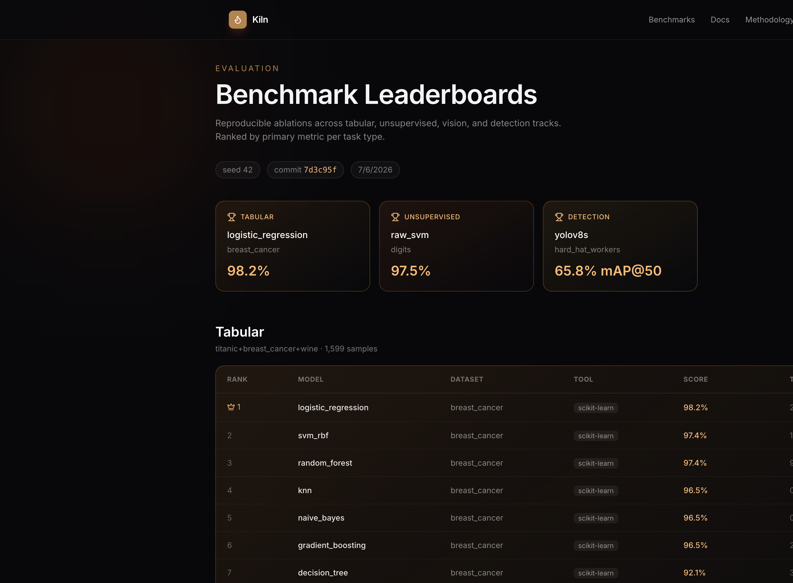

# Kiln — Forge Every Algorithm on Real Data

[](https://github.com/jahidbappi/kiln-ml/actions/workflows/ci.yml)
[](https://www.python.org/downloads/)
[](LICENSE)
[](https://github.com/jahidbappi/kiln-ml/releases)

**Kiln** is a unified ML/CV benchmark platform that compares 20+ classical and deep models across Kaggle, sklearn, Keras, Roboflow, and Ultralytics datasets — with reproducible leaderboards and Colab GPU workflows.

**Live:** [kiln-ml.vercel.app](https://kiln-ml.vercel.app) · **Leaderboards:** [benchmarks](https://kiln-ml.vercel.app/benchmarks) · **Methodology:** [docs/methodology](https://kiln-ml.vercel.app/docs/methodology)

<p align="center">
  <a href="https://kiln-ml.vercel.app/benchmarks">
    
  </a>
</p>

## Portfolio context

| Project | Role |
|---------|------|
| [Iris](https://github.com/jahidbappi/iris) | GenAI multimodal product |
| [Mosaic](https://github.com/jahidbappi/mosaic-rag) | RAG evaluation |
| **Kiln** | Classical + CV ML evaluation |

## Quick start

```bash
cd kiln-ml
python -m venv .venv && source .venv/bin/activate
pip install -e ".[dev,vision]"
kiln-benchmark --track all --seed 42 --output benchmarks/results
```

## Tracks

| Track | Datasets | Tools | Models |
|-------|----------|-------|--------|
| **Tabular** | Titanic, Breast Cancer, Wine | sklearn, Kaggle CSV | LR, SVM, kNN, NB, DT, RF, GBM + regressors |
| **Unsupervised** | Iris, Digits | sklearn, OpenCV | k-Means, DBSCAN, Agglomerative, PCA+SVM/kNN |
| **Vision** | Fashion-MNIST | Keras, OpenCV | Flatten+RF, MLP, CNN |
| **Detection** | Hard Hat Workers | Roboflow, Ultralytics | YOLOv8n vs YOLOv8s (verified Colab GPU) |

## CLI

```bash
kiln-benchmark --track tabular --seed 42
kiln-benchmark --track vision --epochs 5
kiln-benchmark --track detection   # uses verified metrics or local dataset if present
kiln-benchmark --track all --no-vision
```

## Reproducibility

Every leaderboard JSON includes `timestamp`, `seed`, `commit`, and dataset citations. Detection metrics document Colab GPU run parameters — see [METHODOLOGY.md](./METHODOLOGY.md).

## Colab notebooks

Open `notebooks/` in Google Colab for GPU YOLO training and full CNN runs.

## Development

```bash
pip install -e ".[dev,vision]"
ruff check src tests
pytest
```

See [CONTRIBUTING.md](./CONTRIBUTING.md) and [CHANGELOG.md](./CHANGELOG.md).

## License

MIT — see [DATASETS.md](./DATASETS.md) for dataset citations.
